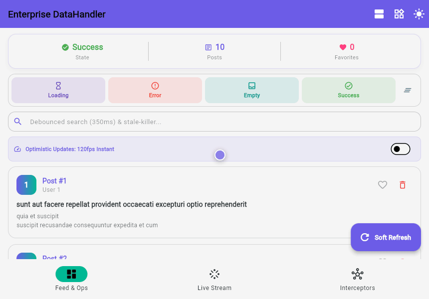

# DataHandler Example 🚀

This sample demonstrates all the enterprise capabilities of **DataHandler** across platforms (Mobile, Desktop, and Web).

## 🖥️ Web Preview



## 🌟 Featured Demonstrations

- **Smart State Management**: Dynamic transitions across `Loading`, `Success`, `Error`, and `Empty` states.
- **Selective Micro-Rebuilds (`select<R>`)**: Zero-overhead widget updates when model fields mutate.
- **Low-Memory Pagination (`appendData`)**: High-performance infinite scrolling without cloning large lists in memory.
- **Debounced Search & Stale Response Killer**: Prevents out-of-order race conditions when users search.
- **Optimistic Updates & Auto-Rollback**: Instant 120fps UI response with automatic error recovery.
- **Real-Time Stream Binding (`bindStream`)**: Connects directly to WebSockets or streams with leak-free auto-disposal.
- **Team Interceptors & Error Formatter**: Centralized telemetry, logging, and error mapping.

## 🚀 Running the Example

### Run in Web
```sh
flutter run -d chrome
```

### Run in Mobile / Desktop
```sh
flutter run
```
